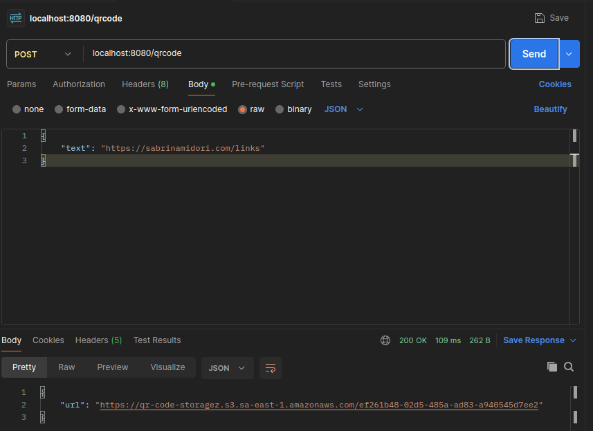
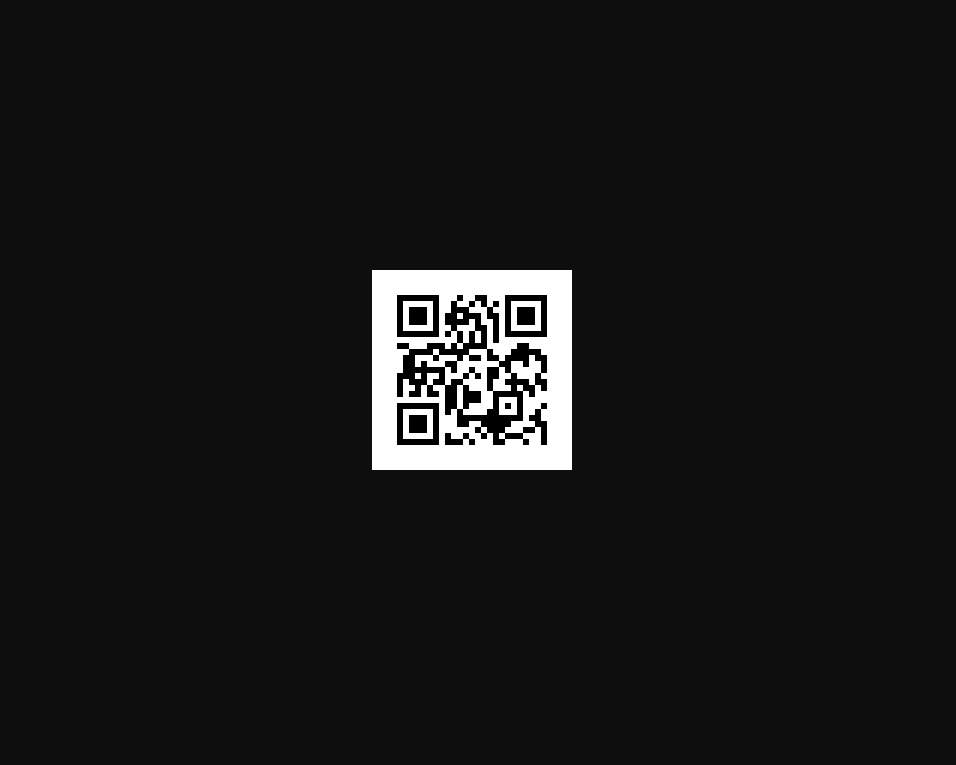

# QR Code Generator API

A **Spring Boot** application that generates **QR Code images** from text or URLs and stores them in an **Amazon S3 bucket**.
The application is containerized with **Docker** and designed to run consistently across environments.

**Credits:** Fernanda Kipper Dev

---

## 🚀 Overview

This service provides a REST API that:

* Generates QR Code images from text or URLs
* Uploads the generated image to **Amazon S3**
* Returns a publicly accessible URL for each generated QR Code

The application follows best practices such as externalized configuration and cloud-ready design principles.

---

## 🏗️ Architecture Highlights

* Stateless REST API
* Object storage via Amazon S3
* Public asset delivery directly from S3
* Configuration via environment variables
* Docker-based runtime isolation

This approach avoids streaming files through the backend, improving scalability and performance.

---

## 🛠️ Technologies

* Java
* Spring Boot
* Maven
* Docker
* Amazon S3
* AWS SDK

---

## 📦 Prerequisites

* Docker
* AWS account
* An existing Amazon S3 bucket
* AWS credentials with write permission to the bucket

> 🔐 For local development, credentials may be configured via environment variables or AWS profiles. See this [guide](https://www.kipperdev.com.br/blog/guia-completo-para-configurar-aws-no-intellij/).

---

## ▶️ Running the application

### Step 1 - Amazon S3 Bucket Configuration

1. Open **AWS Console → S3**
2. Create a bucket with:
   * A globally unique name
   * The desired AWS region
3. Enable encryption (recommended)
4. Complete bucket creation

Since the API returns **direct URLs**, the objects must be publicly readable.

⚠️ This bucket **must only store public assets** (QR Code images).

Add the following **bucket policy** (replace the bucket name):

```json
{
    "Version": "2012-10-17",
    "Statement": [
        {
            "Sid": "PublicReadGetObject",
            "Effect": "Allow",
            "Principal": "*",
            "Action": "s3:GetObject",
            "Resource": "arn:aws:s3:::your_bucket_name/*"
        }
    ]
}
```

#### What this policy allows

* Public read access (`GET`) to objects
* No permission to upload, delete, or list objects

### Step 2 - Clone the repository

```bash
git clone <repository-url>
cd qrcode-generator
```

### Step 3 - Create a `.env` file

```env
AWS_ACCESS_KEY_ID=your_access_key
AWS_SECRET_ACCESS_KEY=your_secret_key
AWS_REGION=your_aws_region
AWS_S3_BUCKET=your_bucket_name
```

⚠️ **Important**

* Never commit this file
* Do not expose credentials in version control
* In production, prefer **IAM roles** instead of static credentials


### Step 4 - Build and run with Docker

```bash
docker build -t qrcode-generator:latest .
docker run --env-file .env -p 8080:8080 qrcode-generator:latest
```

The application will start on:

```
http://localhost:8080
```

---

## 🌐 API Usage

You can test the application using **Postman**, **Insomnia**, or **cURL**.

### Endpoint

```
POST /qrcode
```

Example:

```
POST http://localhost:8080/qrcode
```

### Request body

```json
{
  "text": "https://example.com"
}
```

### Response

* A QR Code image is generated
* The image is uploaded to Amazon S3
* The API returns a **public URL** pointing directly to the image



* Opening this URL in your browser displays the QR Code image



### cURL example

```bash
curl -X POST http://localhost:8080/qrcode \
  -H "Content-Type: application/json" \
  -d '{"text":"https://example.com"}'
```

---

## 📌 Intended Use

This project is intended for:

* Learning and experimentation
* Backend portfolio demonstrations
* Cloud storage integration examples

It can be extended to production usage with additional security hardening and observability.